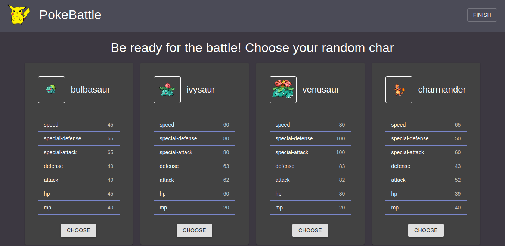
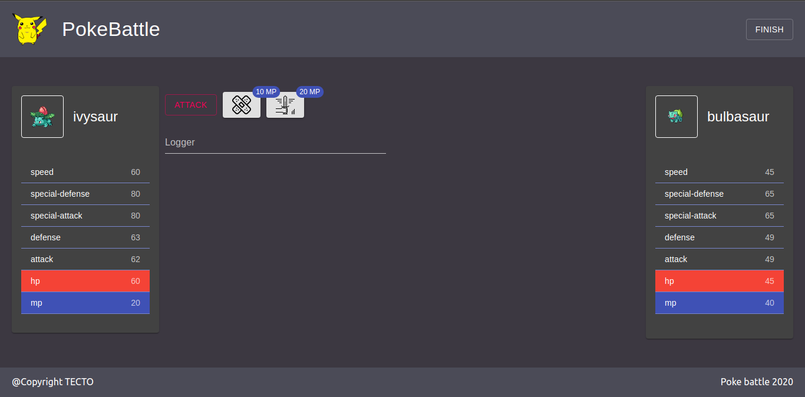

# PokeBattle - Pokemon React game

## Used
1. React
2. Redux
3. Redux saga
4. Typescript
5. Material UI
6. Axios
7. React Router
8. React testing library

## App features
1. Typed Api
2. Global alert component
3. React & Redux hooks
4. Custom hooks
5. Full unit-testing
6. 'Features' app structure
7. Battle loger

## Screenshots

*Main screen*

*Battle screen*

